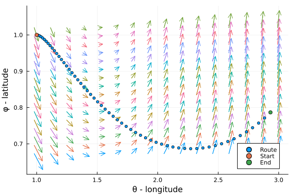
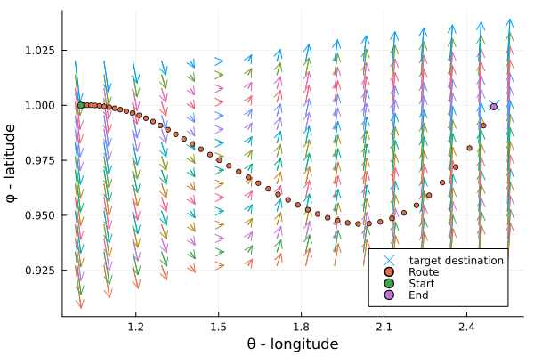

# AircraftRouteDynamics

[![CI][ci-img]][ci-url] 

[ci-img]: https://github.com/arturgower/AircraftRouteDynamics.jl/actions/workflows/ci.yml/badge.svg
[ci-url]: https://github.com/arturgower/AircraftRouteDynamics.jl/actions/workflows/ci.yml

A Julia library for simulating and calculating optimal routes for commercial aircrafts. 

The package uses some simplified dynamics to capture the main contributions to drag, wind, and thrust. Routes can be chosen to minimise fuel or flight time.

## Installation
This package is currently not registered, so to install it you will need to type in the Julia terminal: 
```julia
julia> ]
pkg> add https://github.com/arturgower/AircraftRouteDynamics.jl
then press the backspace key followed by
```julia
julia> using AircraftRouteDynamics
```

## Route simulation

Here we give a simple example of simulating one route, and below show how to find an optimal route.

First define the aircraft and then the simulation parameters
```julia
using AircraftRouteDynamics

aircraft = Aircraft(
    altitude = 8,
    empty_weight = 4.0, 
    drag_coefficient = 1.5 # currently isotropic drag
)

setup = RouteSetup(
    aircraft = aircraft,
    iterations = 400, 
    dt = 0.01, 
    θφ_initial = [1.0,1.0], 
    initial_velocity = [1.0,0.0],
)
```
where `initial_velocity` is the velocity vector of the aircraft at the beginning of the route. `θφ_initial` is the initial $(\theta, \phi)$ position in the spherical coordinate system $(r,\theta,\phi)$ with
$$
\vec x = r [ \sin \phi \cos \theta, \sin \phi \sin \theta,   \cos \phi].
$$
Note that latitude $\lambda = \pi/2 - \phi$ while longitude $L = \theta$.

Finally, we specify use of fuel, how much the pilot tries to turn `turns`, and wind speed, after which we simulate the route. 
```julia
    # fuel use over time
    fuel = LinRange(10,4,setup.iterations);

    # turns over time
    turns = 0.0 .* fuel .- 0.3

    # Let's use a tornado around $(\theta,\phi) = (1.5,1.5)$
    tornado_wind(x, y, wind_vel = 10.0) = wind_vel .* [-y+1.5, x-1.5] ./ (sqrt(x^2 + y^2))

    wind_speed(x, y) = tornado_wind(x, y)

    # calculate route
    r = route(setup, fuel, turns, wind_speed)
```
Note on a normal PC the above simulation takes around 100 microseconds. 

If you have `Plots.jl` installed you can then easily plot the wind and route with
```julia
using Plots

plot(r,wind_speed; wind_amplitude = 1e-2, step_size = 7)
# savefig("docs/imgs/readme-1.png")
```


To learn about external forces on the aircraft you can plot `r.forces`.

## Route optimisation

Let us use the same example above but look for optimal routes between a start and end point. It seems that in the previous example the aircraft could reach the point $(\theta,\phi) = (1.0,2.5)$ if it turned enough. Let us find optimal routes to achieve this.

First we need to adjust the setup to specify the maximum amount of fuel and an end destination:
```julia
aircraft = Aircraft(
    altitude = 8,
    empty_weight = 4.0, 
    drag_coefficient = 1.5,
    fuel = 10.0, # maximum fuel available
    fuel_burn_rate = 2.0 # typical fuel burn rate in time
)

setup = RouteSetup(
    aircraft = aircraft,
    iterations = 400, 
    dt = 0.01, 
    θφ_initial = [1.0,1.0], 
    θφ_end = [2.5,1.0], # target end destination
    initial_velocity = [1.0,0.0],
    tol = 1e-2 # a tolerance for reaching the end destination
)
```
Note it is quite easy to give an end destination which is impossible for the amount of fuel given and wind speeds. The `fuel_burn_rate` is used to calculate the maximum (`2.0 * fuel_burn_rate`) fuel burn rate.

The code to optimise the route has not been integrated into the package. Instead, we rely on the package `Optim` to find optimal routes.

```julia
using Optim 

function f(x, setup, wind_speed)
    turns, fuel = x_to_control_variables(x,setup)
    r = route(setup, fuel, turns, wind_speed)

    return objective(r, setup) # minimise time
end

options = Optim.Options(f_tol = 1e-8)

# number of variables to be optimised
numberofvariables = 10;
i = Int(round(numberofvariables / 2))

# initial guess for [turns; fuel_use]
initial_guess = [zeros(i); ones(i)]

res = optimize(x -> f(x,setup,wind_speed), initial_guess, options)

# extract the turns and fuel from the optimal x given.
turns, fuel = x_to_control_variables(res.minimizer, setup) 

# calculate the route that was achieve for the given turns and fuel
r = route(setup, fuel, turns, wind_speed)
r = clip_route(r, setup)

scatter(setup.θφ_end[1:1], setup.θφ_end[2:2], 
    markersize = 6.0, m = :xcross,
    lab = "target destination"
)
plot!(r,wind_speed; wind_amplitude = 5e-3, step_size = 7)
# savefig("docs/imgs/readme-2.png")
```


We can now explore the fuel use and turns 
```julia
plot(r.fuel, xlab = "time steps", ylab = "fuel use", ylims = (0, :auto))
# savefig("docs/imgs/readme-3.png")
plot(r.turns, xlab = "time steps", ylab = "turns")
# savefig("docs/imgs/readme-4.png")
```


Note that as we only used 10 control variables, there are only 5 changes in the turns and 5 changes in fuel use.

## Minimise fuel use

We now repeat the process above and try to find another route, one which minimises fuel use instead of time. We note that the previous route used almost all the fuel available.

```julia
function f(x, setup, wind_speed)
    turns, fuel = x_to_control_variables(x,setup)
    r = route(setup, fuel, turns, wind_speed)

    return objective_fuel(r, setup) # minimise fuel
end

res = optimize(x -> f(x,setup,wind_speed), initial_guess, options)

turns, fuel = x_to_control_variables(res.minimizer, setup) 

r_fuel = route(setup, fuel, turns, wind_speed)
r_fuel = clip_route(r_fuel, setup)

scatter(setup.θφ_end[1:1], setup.θφ_end[2:2], 
    markersize = 6.0, m = :xcross,
    lab = "target destination"
)
plot!(r_fuel,wind_speed; wind_amplitude = 5e-3, step_size = 7, lab = "fuel efficient")

# let's overlay the minimum time flight
scatter!(r.θs[1:5:end], r.φs[1:5:end], markersize = 3.0, lab = "fast flight")
# savefig("docs/imgs/readme-5.png")

# gr(size = (360,280))
plot(r_fuel.fuel, lab = "fuel efficient")
plot!(r.fuel, lab = "fastest", 
    xlab = "time steps", 
    ylab ="fuel"
)
# savefig("docs/imgs/readme-6.png")

```


We can see that the fuel efficient flight took a longer route that better used the wind.

## Reference 

To cite this work first choose a version (ex: v0.0.1) then please use:

"AircraftRouteDynamics.jl" v0.0.1. Github. (2025): github.com/arturgower/AircraftRouteDynamics.jl

or for bibtex:

@software{gower2025AircraftRouteDynamics,
  title={AircraftRouteDynamics.jl},
  author={Gower, Artur L},
  version={v0.0.1},
  url={github.com/arturgower/AircraftRouteDynamics.jl},
  year={2025}
}
